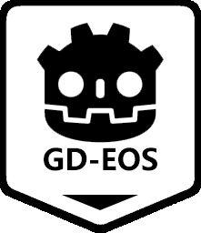

# GD-EOS

[点击查中文说明](README.zh.md)



**Epic Online Services** for Godot. Use as **C++ SDK** or compile as **GDScript SDK**.

## Feature

1. OOP and Godot Style, all APIs have been typed as far as possible.
2. Almost APIs are generated from EOS C SDK, you can refer Epic Online Services document directly.
3. `EOSMultiplayerPeer` for godot multiplayer.

## Support Me

This project is cost a lot of time and effort, if it can help you, please [buy me a coffee](https://afdian.net/a/Daylily-Zeleen).

## Valid EOS SDK Version

- EOS-SDK-32273396-v1.16.2
- EOS-SDK-27379709-v1.16.1

## How to start

1. Get `GD-EOS` plugin:
   - Download pre-compiled plugin from release page.
   - Compile by yourself.
2. Install it like regular Godot plugin.
3. Initialize EOS correctly, then you can use singletons of EOS. Here is a simple example:

   ```GDScript
    extends Node

    # EOS settings, you can get these from your epic developer portal.
    # For publishing, it is better not to store in clear text.
    @export var product_name: String = ""
    @export var product_version: String = ""
    @export var product_id: String = ""
    @export var sandbox_id: String = ""
    @export var deployment_id: String = ""
    @export var client_id: String = ""
    @export var client_secret: String = ""
    @export var encryption_key: String = ""

    func _ready() -> void:
        # Initialize EOS
        var init_options := EOSInitializeOptions.new()
        init_options.product_name = product_name
        init_options.product_version = product_version
        var result_code: EOS.Result = EOS.initialize(init_options)
        if result_code != EOS.Success:
            printerr("Initialize EOS faild: ", EOS.result_to_string(result_code))
            return

        # Setup Logging.
        EOS.set_logging_callback(_eos_log_callback)
        EOS.set_log_level(EOS.LC_ALL_CATEGORIES, EOS.LOG_Info)

        # Create platform
        var create_options := EOSPlatform_Options.new()
        create_options.product_id = product_id
        create_options.sandbox_id = sandbox_id
        create_options.deployment_id = deployment_id
        create_options.client_credentials = EOSPlatform_ClientCredentials.new()
        create_options.client_credentials.client_id = client_id
        create_options.client_credentials.client_secret = client_secret
        create_options.encryption_key = encryption_key
        create_options.flags = EOSPlatform.PF_WINDOWS_ENABLE_OVERLAY_OPENGL
        EOSPlatform.platform_create(create_options)


    # Log callback.
    static func _eos_log_callback(category: String, message: String, level: EOS.LogLevel) -> void:
        var msg: String = "[%s]: %s" % [category, message]
        if level >= EOS.LOG_Info:
            print(msg)
        elif level >= EOS.LOG_Warning:
            print_rich("[color=yellow]%s[/color]" % msg)
        elif level >= EOS.LOG_Error:
            print_rich("[color=orange]%s[/color]" % msg)
        else:
            printerr(msg)
   ```

4. Now, you can use all functions of EOS, please refer [Epic Online Services' document](https://dev.epicgames.com/docs) for more details.

## How to run `test_project`

1. Enable required features for you product in developer portal. For convenience, you can enable all features of your client policy, or use the redefine policy "Peer2Peer".
2. Set your product parameters to the root node of "main.tscn" scene.
3. Prepare two Epic accounts; or use one Epic Account and use two login way at the same time which describe below.
4. Run project with two instances to login:
   1. Set "External Credential Type" to "EPIC":
        i. Set "Login Credential Type" to "AccountPortal", keep "Id" and "Token" empty, click "Login" button an jump to external browser to request authentification.
        ii. Set "Login Credential Type" to "Developer"，you need to login your Epic Accounts with token in **DevAuthTool** which in the "Tools" folder of EOS SDK.
            - Set "Id" to the address of **DevAuthTool**，如 `localhost:8081`
            - Set "Token" to the token of your account which is defined in **DevAuthTool**.
   2. Set "External Credential Type" to "DEVICESSID_ACCESS_TOKEN":
        It will create a token which relate your device.
5. After login, user "Create" button to create a lobby in one instance, then click "Refresh" button to get lobby list, select a lobby and join it by "Join" button.
6. Now, the two instances should be able to play together.

## How to compile

1. Clone this repo with submodule (godot-cpp).
2. Download EOS C SDK from Epic Developer Portal, and place is at "thirdparty/eos-sdk". (Because I have not right to redistribute it).
3. [Setup your enviroment](https://docs.godotengine.org/en/latest/contributing/development/compiling/index.html#building-for-target-platforms). In orther words, you need `python3`, `scons`, and an appropriate c++ compiler. Additionally, you need ndk to compile for android.
4. Navigate to this project root, and run commands below:
    - For debug build:

        ``` shell
            scons platform=windows target=template_debug dev_build=yes
        ```

    - For release build:

        ``` shell
            scons platform=windows target=template_release
        ```

    More detail of compile commands, please refer to godot-cpp's compile system.
5. Last, you can get the compiled addon which is localed at "test_project/addons/gd-eos/".

## **Cautious**

This repo is lack of testing. Don't use this for your release project.
Expacially andriod build, it may not work at all.

## TODO

1. Detect deprecated menbers instead of heard codeing.
2. Generate typed callback apis for c++ user.
3. Add ios build.

## Others

1. Thanks to Delano Lourenco.The Godot multiplayer mechanism is base on [epic-online-servies-godot](https://github.com/3ddelano/epic-online-services-godot).
2. Welcome to submit any pr for bug fix or improvement.
