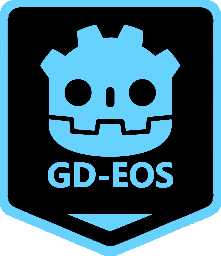

# GD-EOS

[点击查中文说明](README.zh.md)



**Epic Online Services** for Godot. Use as **C++ SDK** or compile as **GDScript SDK**.

## Feature

1. OOP and Godot Style, all APIs have been typed as far as possible.
2. Almost APIs are generated from EOS C SDK, you can refer Epic Online Services document directly.
3. `EOSMultiplayerPeer` for godot multiplayer.
4. Support Windows, Linux, macOS, Android, iOS.

## Support Me

This project is cost a lot of time and effort, if it can help you, please [buy me a coffee](https://afdian.com/a/Daylily-Zeleen).

## Valid EOS SDK Version

- EOS-SDK-36651368-v1.16.4
- EOS-SDK-Android-32303053-v1.16.3
- EOS-SDK-32303053-v1.16.3

> Outdated
>
> - EOS-SDK-32273396-v1.16.2
> - EOS-SDK-27379709-v1.16.1
> - EOS-SDK-Android-27379709-v1.16.1

## How to start

**Video Tutorial: https://youtu.be/7CHBd7MAiu0** (pull this repo, get EOS SDK, compile, run the demo project.)

1. Get `GD-EOS` plugin:
   - Download pre-compiled plugin from release page.
   - Compile by yourself.
2. Install it like regular Godot plugin.
3. Initialize EOS correctly, then you can use singletons of EOS. Here is a simple example:

   ```GDScript
    extends Node

    # EOS settings, you can get these from your epic developer portal.
    # For publishing, it is better not to store in clear text.
    @export var product_name: String = ""
    @export var product_version: String = ""
    @export var product_id: String = ""
    @export var sandbox_id: String = ""
    @export var deployment_id: String = ""
    @export var client_id: String = ""
    @export var client_secret: String = ""
    @export var encryption_key: String = ""

    func _ready() -> void:
        # Initialize EOS
        var init_options := EOSInitializeOptions.new()
        init_options.product_name = product_name
        init_options.product_version = product_version
        var result_code: EOS.Result = EOS.initialize(init_options)
        if result_code != EOS.Success:
            printerr("Initialize EOS failed: ", EOS.result_to_string(result_code))
            return

        # Setup Logging.
        EOS.set_logging_callback(_eos_log_callback)
        EOS.set_log_level(EOS.LC_ALL_CATEGORIES, EOS.LOG_Info)

        # Create platform
        var create_options := EOSPlatform_Options.new()
        create_options.product_id = product_id
        create_options.sandbox_id = sandbox_id
        create_options.deployment_id = deployment_id
        create_options.client_credentials = EOSPlatform_ClientCredentials.new()
        create_options.client_credentials.client_id = client_id
        create_options.client_credentials.client_secret = client_secret
        create_options.encryption_key = encryption_key
        create_options.flags = EOSPlatform.PF_WINDOWS_ENABLE_OVERLAY_OPENGL
        EOSPlatform.platform_create(create_options)


    # Log callback.
    static func _eos_log_callback(category: String, message: String, level: EOS.LogLevel) -> void:
        var msg: String = "[%s]: %s" % [category, message]
        if level >= EOS.LOG_Info:
            print(msg)
        elif level >= EOS.LOG_Warning:
            print_rich("[color=yellow]%s[/color]" % msg)
        elif level >= EOS.LOG_Error:
            print_rich("[color=orange]%s[/color]" % msg)
        else:
            printerr(msg)
   ```

4. Now, you can use all functions of EOS, please refer [Epic Online Services' document](https://dev.epicgames.com/docs) for more details.

## How to run `demo`

**Video Tutorial: https://youtu.be/7CHBd7MAiu0** (pull this repo, get EOS SDK, compile, run the demo project.)

1. Enable required features for you product in developer portal. For convenience, you can enable all features of your client policy, or use the redefine policy "Peer2Peer".
2. Set your product parameters to the root node of "main.tscn" scene.
3. Prepare two Epic accounts; or use one Epic Account and use two login way at the same time which describe below.
4. Run project with two instances to login:
   1. Set "External Credential Type" to "EPIC":
        1. Set "Login Credential Type" to "AccountPortal"：
            - You should ensure your EPIC Account is added to your organization member, and have a appropriate role.
            - The permissions of your application in Epic Account Services should enable "Basic Profile", "Online Presence", "Friend", **but "Country" should keep disabled**.
            Keep "Id" and "Token" empty, click "Login" button an jump to external browser to request authentification.
        2. Set "Login Credential Type" to "Developer"，you need to login your Epic Accounts with token in **DevAuthTool** which in the "Tools" folder of EOS SDK.
        - Set "Id" to the address of **DevAuthTool**，for example: `localhost:8081`
        - Set "Token" to the token of your account which is defined in **DevAuthTool**.
   2. Set "External Credential Type" to "DEVICESSID_ACCESS_TOKEN":
        It will create a token which relate your device.
5. After login, user "Create" button to create a lobby in one instance, then click "Refresh" button to get lobby list, select a lobby and join it by "Join" button.
6. Now, the two instances should be able to play together.

## How to compile

**Video Tutorial: https://youtu.be/7CHBd7MAiu0** (pull this repo, get EOS SDK, compile, run the demo project.)

1. Clone this repo with submodule (godot-cpp).
2. Download EOS C SDK from Epic Developer Portal, and place is at "thirdparty/eos-sdk". (Because I have not right to redistribute it).
3. [Setup your enviroment](https://docs.godotengine.org/en/latest/contributing/development/compiling/index.html#building-for-target-platforms). In orther words, you need `python3.9(or later version)`, `scons`, and an appropriate c++ compiler. Additionally, you need ndk to compile for android.
4. Navigate to this project root, and run commands below:
    - For debug build:

        ``` shell
            scons platform=windows target=template_debug debug_symbols=yes
        ```

    - For release build:

        ``` shell
            scons platform=windows target=template_release
        ```

    More detail of compile commands, please refer to godot-cpp's compile system.
    **If you change the output library name by using compile options, please modify "demo/addons/gd-eos/gdeos.gdextension" to fit your library name.**
5. Last, you can get the compiled addon which is located at "demo/addons/gd-eos/".

Additionally, if you compile with godot-cpp 4.3(or later version) and use Godot 4.3(or later version), you can generate and compile with editor documents:
6. Run command below to generate/update document files of this plugin:

``` shell
Godot_v4.3-stable_win64.exe --path demo --doctool .. --gdextension-docs
```
You should replace "Godot_v4.3-stable_win64.exe" to your Godot editor's executable file.

7. Compile again like **step 4**.
8. Now，you can refer classes' document of this plugin in Godot editor help like native Godot classes.

**NOTE**: the generated documents is extracted and modified procedurally from the source EOS-SDK, so **it may not be accurate, just for reference**.

## **About AOOLU (Assume Only One Local User) Version**

Since EOS-SDK allows multiple users to log in simultaneously, you will frequently encounter APIs that require passing in a `local_user_id` to determine which local user is calling the interface. However, in game developing, we generally only use one local user. To reduce this inconvenience, this plugin can be compiled with the `assume_only_one_local_user=yes` flag to create the AOOLU (Assume Only One Local User) version.

In this version, apart from the `EOSAuth` and `EOSConnect` interfaces, the `local_user_id` parameter is hidden in most of the other APIs, and the parameter is filled internally when needed( the usage of the `EOSAuth` and `EOSConnect` interfaces is the same as in the non-AOOLU version, because you might need to manager the linkage between different accounts).

To use this version, you must use`EOSConnect.login()` to set an `EOSProductUserId` as the local user ID internally, and use `EOSAuth.login()` to set an `EOSEpicAccountId` as the local user ID internally (if you log in with different accounts multiple times, the local user ID will be set to the last logged-in user). Otherwise, when calling other APIs, it will return `EOS.Result.InvalidParameters` and throw an appropriate error message as a prompt.

By the way, you can use `EOSProductUserId.get_local()` and `EOSEpicAccountId.get_local()` to get current local user id, **but don't release the return value of these interfaces manually!!**.

## **Known issues**

1. If you want to use overlay (only available for Windows), pay attention to the settings of the renderer.
2. About Android exporting, if you use precompiled binary library, you need to download `EOS-SDK-Android-32303053-v1.16.3`(pay attention to the version) from epic developer portal for getting "aar" file (again, I have not right to dispatch SDK).
3. `XxxAttributeData.Key` will be converted to upper case when transferring to remote peer, you should not use lower characters in your key.
4. It is not recommended to use `1.16.1` or previous version, because `1.16.2` fixed many bugs.
5. Only the first user who use `EOSConnect` interface to login can use `EOSMultiplayerPeer` and `EOSMultiplayerMediator` (the EOS SDK allow multiple users to login in one process. You can see many APIs determine user by passing a `local_user_id` argument).

## Exporting for Android

**Video Tutorial：https://youtu.be/Sh08JCT1lhg** (Exporting for Android)

1. Download "EOS Android SDK 1.16.3(or 1.16.2, but not recommend)" from [Epic Developer Portal](https://dev.epicgames.com/portal), unzip it and put its `SDK` folder under the `thirdparty/eos-sdk` directory, then compile this plugin:

    ```shell
    scons platform=android target=tempalte_debug ANDROID_HOME="path/to/your/android/sdk"
    scons platform=android target=tempalte_release ANDROID_HOME="path/to/your/android/sdk"
    ```

    After compiling, copy the plugin to your Godot Project.
2. Follow the tutorial [Gradle builds for Andriod](https://docs.godotengine.org/en/stable/tutorials/export/android_gradle_build.html), generate an android project at `res://android/build`.
3. Configure your android project by following the [Epic Online Services document](https://dev.epicgames.com/docs/epic-online-services/platforms/android#4-add-the-eos-sdk-to-your-android-studio-project).
   1. Add `SDK/Bin/Android/static-stdc++/aar/eossdk-StaticSTDC-release.aar`, assign its configuration as `implementation`, as dependency to your android project.
   2. Add other dependencies which required by "EOS Andoird SDK".
        At last, the `dependencies` section in `build.gradle` file will like this:

        ```gradle
        dependencies {
            // Other dependencies...

            // EOS dependencies...
            implementation files('path\\to\\static-stdc++\\aar\\eossdk-StaticSTDC-release.aar')
            implementation 'androidx.appcompat:appcompat:1.5.1'
            implementation 'androidx.constraintlayout:constraintlayout:2.1.4'
            implementation 'androidx.security:security-crypto:1.0.0'
            implementation 'androidx.browser:browser:1.4.0'
        }
        ```

   3. Add your "ClientId" of your Product to android configuration:
       1. Follow the Epic Document, add it to `string.xml`.
       2. **Or** add it to the sub section `defaultConfig` of the sections `android` in `build.gradle` file:

            ```gradle
            android {
                ... other code

                defaultConfig {
                    ... other code
                
                    // This is needed by EOS Android SDK
                    String ClientId = "PUT YOUR EOS CLIENT ID HERE"
                    resValue("string", "eos_login_protocol_scheme", "eos." + ClientId.toLowerCase())
                }
            }
            ```

   4. According to the requirement of "EOS Android SDK", update the `minSdk` to `23`.
   5. Modify `src/com/godot/game/GodotApp.java`:
      1. Load `EOSSDK` library.
      2. Initialize `EOSSDK`.
        At last, it will like this:

        ```java
        package com.godot.game;

        import com.epicgames.mobile.eossdk.EOSSDK;     // added
        import org.godotengine.godot.GodotActivity;

        import android.os.Bundle;

        public class GodotApp extends GodotActivity {
            static {                                   // added
                System.loadLibrary("EOSSDK");          // added
            }                                          // added
        
            @Override
            public void onCreate(Bundle savedInstanceState) {
                EOSSDK.init(getActivity());             // added

                setTheme(R.style.GodotAppMainTheme);
                super.onCreate(savedInstanceState);
                }
            }
        ```

4. Add a new Android exporting profile, enabled `Use Gradle Build` in `Gradle Build` section, and update `Min SDK` to `23`. Enable required permissions for "EOS Android SDK": `ACESSS_NETWORK_STATE`, `ACCESS_WIFI_STATE` and `INTERNET`. Fill other information if needs.
5. You can export Android APK if there have not problem.

## **Cautious**

This repo is lack of testing. The name of Apis may be changed in later version.

## TODO

1. Detect deprecated members instead of hard coding.
2. Generate typed callback apis for c++ user.

## Others

1. Thanks to Delano Lourenco.The Godot multiplayer mechanism is base on [epic-online-servies-godot](https://github.com/3ddelano/epic-online-services-godot).
2. Welcome to submit any pr for bug fix or improvement.
